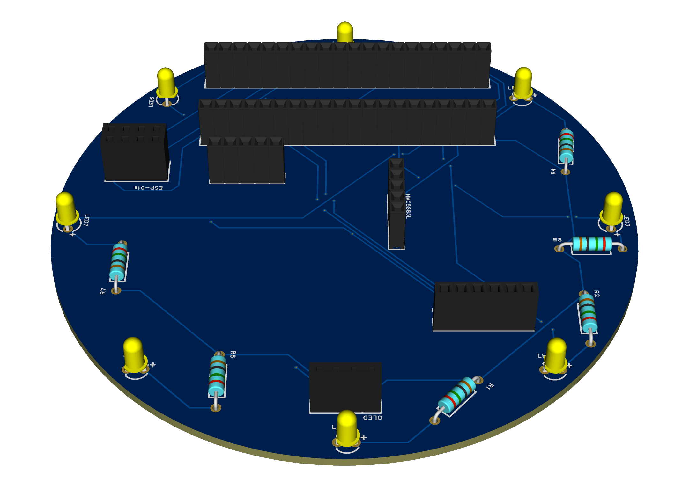
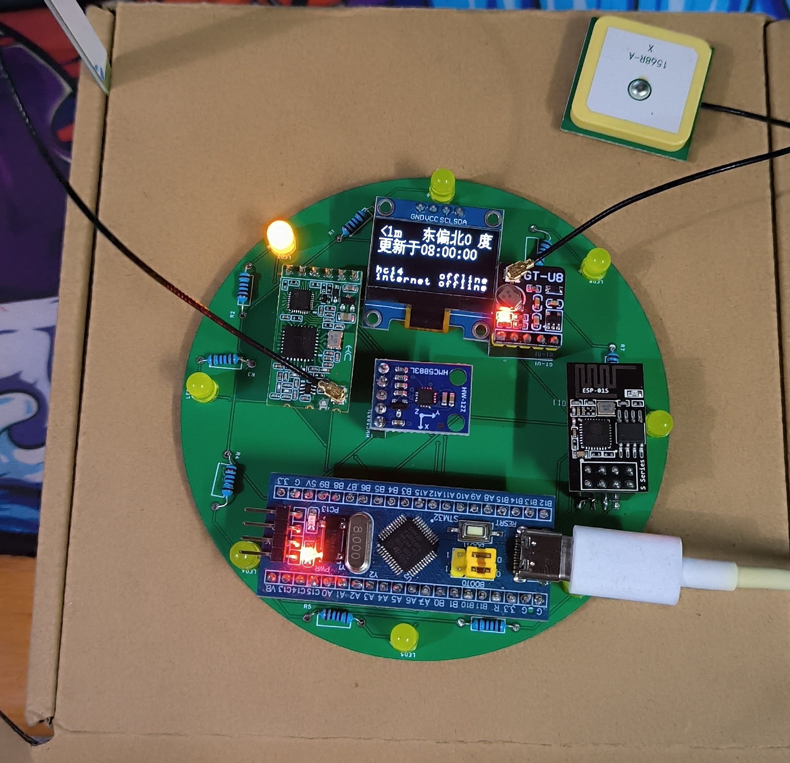

## 情侣寻龙尺


### 简介

指向对方的位置，显示为对方的距离和方向。

通过GPS、电子罗盘等模块，来获取经纬度和磁北的夹角，然后通过对方的经纬度计算距离和角度。如果两个设备在大约1公里范围内，则直接通过433频段的HC-14来进行点对点的通讯，远距离时通过ESP-01s来实现网络通信。


### 开发环境

MCU: stm32f103c8t6

IDE: Keil MDK 5.26.2.0


### 快速开始

1. 通过嘉立创EDA专业版打开```document\couple-pointing.eprj```下单PCB；

2. 购买BOM(```document\DOM.xlsx```)中的模块；
3. ESP-01s刷入MQTT固件([⑦、MQTT透传AT固件（固件号：1471）](https://docs.ai-thinker.com/%E5%9B%BA%E4%BB%B6%E6%B1%87%E6%80%BB))；
4. 焊接母座、LED灯珠、电阻；
5. 根据HC-14资料设置远距离模式；
6. 按照方向插入模块、天线；
7. 配置[详细配置](#详细配置)中的内容；
8. 第一次刷入时候，注意要配置启用``校准HMC5883L（自测模式）``一次；
9. 当刷入第二个设备时候，注意要将```MQTT订阅```内容互换；
10. 第二个设备也是需要进行一次``校准HMC5883L（自测模式）``。


### 详细配置

```HARDWARE\ESP8266\esp8266.h```

```c
// 配置WiFi
#define ESP8266_WIFI_NAME		"test"
#define ESP8266_WIFI_PASSWORD	"1164442003"
 
// 配置MQTT
#define ESP8266_MQTT_ADDR		"39.107.228.202"
#define ESP8266_MQTT_PORT		1883
 
#define MQTT_CLIENT_ID 	"client"		//id
#define MQTT_USERNAME  	""				//名字
#define MQTT_PASSWORD  	""				//密码

// 配置MQTT订阅
// 当给第二个设备编译烧写时，需要讲这两个内容互换
#define MQTT_TOPIC_ME	"position_B"
#define MQTT_TOPIC_TA	"position_A"
```


```HARDWARE\ESP8266\hmc5883l.h```

```c
// 是否开启校准HMC5883L（自测模式）
// 仅在校准HMC5883下使用
// 校准过程20秒，在20秒内慢速旋转设备，至少旋转一圈
// 校准结果将显示到OLED中，需要手动将结果放到HMC5883L_X_OFFEST、HMC5883L_Y_OFFEST、HMC5883L_K_X、HMC5883L_K_Y中
// 自测模式后可以通过观察led是否一直指向南来判断得到的值是否准确，如果误差较大可以重新启动自测模式
#define HMC5883L_SELFTEST 0

// 偏移量信息
#define HMC5883L_X_OFFEST 0.076147
#define HMC5883L_Y_OFFEST -0.149541
#define HMC5883L_K_X 4.342629
#define HMC5883L_K_Y 4.257812
```


```SYSTEM\sys\sys.h```

```c
// 是否开启DEBUG			
#define DEBUG					0
```


### 展示






### 许可证

[](LICENSE)

使用 Apache 2.0 协议开源，请遵守开源协议。